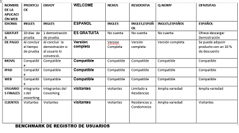
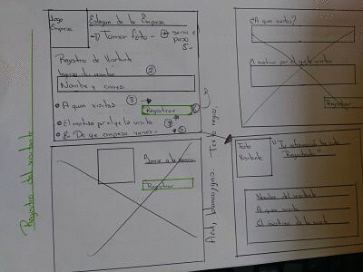
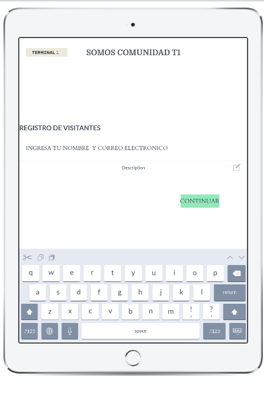
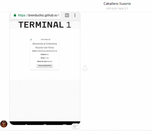
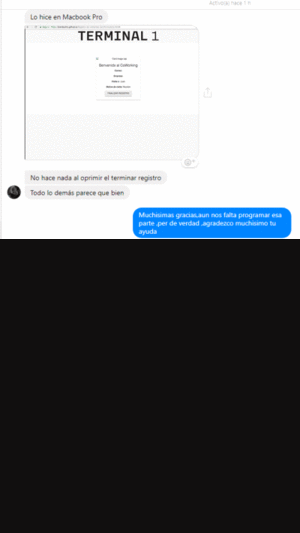

# "Welcome" Registro de visitantes 

# Preámbulo

**Somos Code-Ants ,y en una visita a Terminal 1 ,nos dimos cuenta del problema que presentaba al momento de que muchos usuarios intentaran ingresar al establecimiento ,este problema lo notamos desde el punto de vista como usuarios y mientras esperabamos notamos que los demas usuarios de la fila ,sentian la misma frustracion .**

**Al concluir nuestra visita nuestra UX se acerco a  recepcion para poder pedir el numero  de contacto de los Directores de Terminal 1,al obtenerlo decidio concertar una cita  y poder abordar el tema.**
**Hablamos con Paty  de Terminal 1, fue muy accesible y le planteamos  una propuesta en la que ofreciamos solucionar ese problema le hablamos sobre _"WELCOME"_
El cual es un sistema digital de registro de visitantes que esta en su version de prueba.**
_Asi que Terminal 1 ha decidido ampliar sus horizontes y ha tomado en cuenta la opinion de sus usuarios y ha decidido implementar tecnologia en esta area.
Ya que su establecimiento es usado por programadores   y personas del mundo Tech._

 

# Introducción
**WELCOME solucionara el principal problema que es el tardado acceso a el establecimiento**

**Para conocer mejor  el problema y la opinion de los usuarios se realizo una encuesta,tomando en cuenta su opinion y estas fueron algunas respuestas obtenidas**
 > Chin... otra vez a formarme - Nancy Mejia Gomez.

> Porque tengo que formarme si soy un usuario frecuente -Raquel Gomez

>Voy a llegar tarde
>Estoy perdiendo mi tiempo -Angelica Monroy

>Rayos ya voy tarde - Ana Monserrat Martinez

[Encuestas]https://jazmin64.typeform.com/to/fniSpo

**Tambien se realizaron entrevistas  para conocer si el problema es exclusivo de este establecimiento o hay mas lugares con el mismo problema, y descubrimos que algunos Coworkings ya cuentan con un metodo agil de registro, como son  los establecimientos**

[Entrevistas]
https://drive.google.com/drive/folders/1hTLYWs_n99vnKC1gavYAdSL_4fX0GBq1

- [ ] **We Work - Compañia multinacional  que brinda espacios de trabajo compartidos.**

[WeWork]
https://en.wikipedia.org/wiki/WeWork

- [ ] **CraftWork Coworking - Compañia que  brinda espacios de trabajo compartidos con un excelente ambiente.**

[CraftWork]
http://www.craftworksmexico.com/

#  WELCOME 
 **Para que WELCOME  sea uno de los mejores productos se realizo un estudio de mercado comparando los programas existentes.**

 

# Proceso de Desarrollo y Maquetacion 
**Se elaboraron diseños de baja fidelidad para definir el flujo del programa.**
 

**Tambien se uso un tablero Kanban para hacer fluido el tiempo para el proyecto.**

#### A continuacion se muestra el diseño de como luce la aplicacion en sus distintas plataformas.

 ### La primera es el diseño donde el visitante se registra :

 

 #### Testeo 
 **Se probó esta aplicacion con algunos usuarios para ver si era una aplicacion facil de usar e intuitiva.**

 >El registro está rápido.
 

 

 