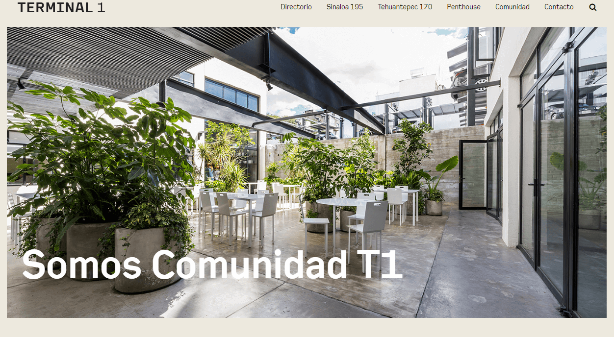
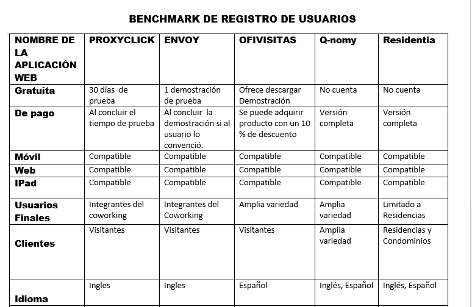
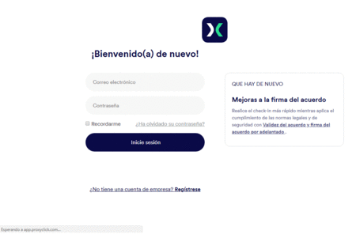
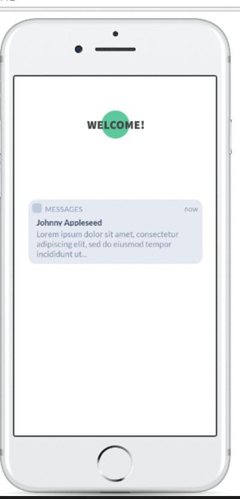
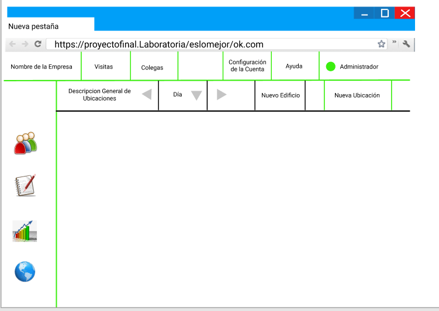

#  WELCOME  

**Somos Code-Ants ,y Terminal 1 ,nos ha contratado para diseñar una pagina web que le permita llevar un mejor control de los susuarios que ingresan a su establecimiento ya que ese es el principal problema que ellos presenta en este momento.**

**Mediante un proceso de Investigacion se han indentificado los puntos de mejora de dicho Co Working;y el primero que pudimos encontrar es el metodo de registro de visitantes que se emplea; es un proceso tedioso y tardado que  dificulta el acceso a dicho lugar .Si mas de un visitante intentan ingresar a dicho establecimiento el metodo de registro se hace demasiado largo ,haciendo que los usuarios se sientan incomodes e inclusive molestos.**

Asi que Terminal 1 ha decidido ampliar sus horizontes y ha tomado en cuenta la opinion de sus usuarios y ha decidido implementar tecnologia en esta area.
Ya que su establecimiento es usado por programadores   y personas del mundo Tech.
 

### Para que WELCOME  sea uno de los mejores productos se realizo un estudio de mercado comparando los existentes y de que manera se diferencia de los otros  ya existentes.

#### A continuacion se muestra el diseño de como luce la aplicacion en sus distintas plataformas.
 ### La primera es el diseño donde el visitante se registra :

 

 ### El siguiente diseño es el que usa la persona que recibira la visita:

 

 ### El siguiente diseño es el que usa el Administrador de la aplicacion ,que es el que le permite  tener un mejor control sobre las visitas:
 

